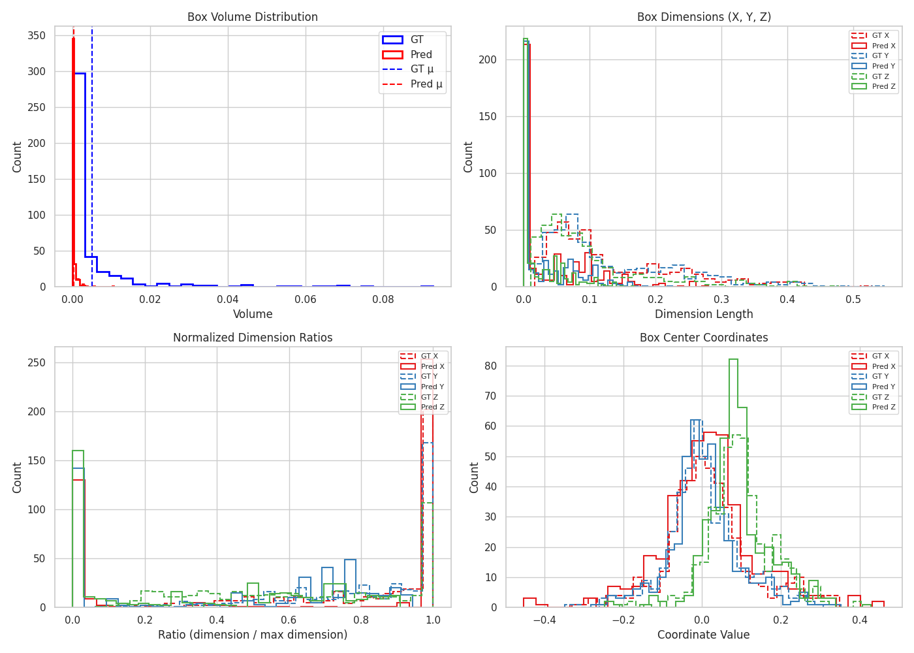
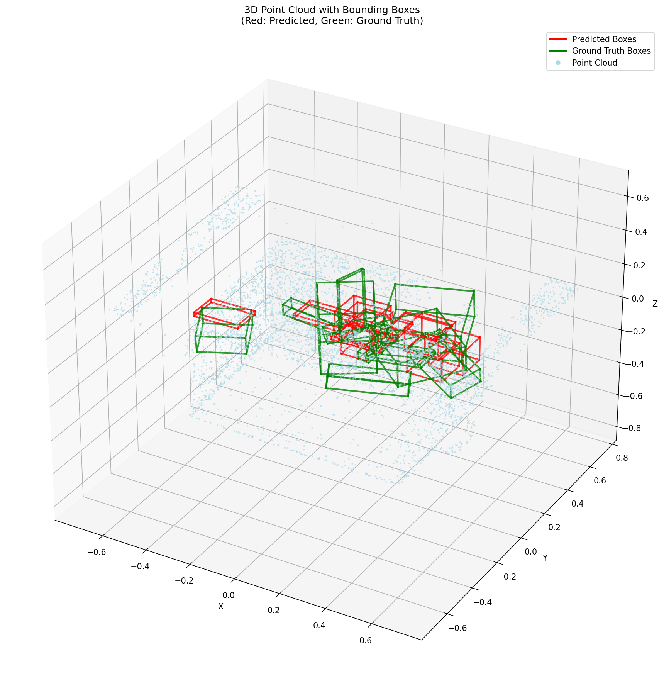
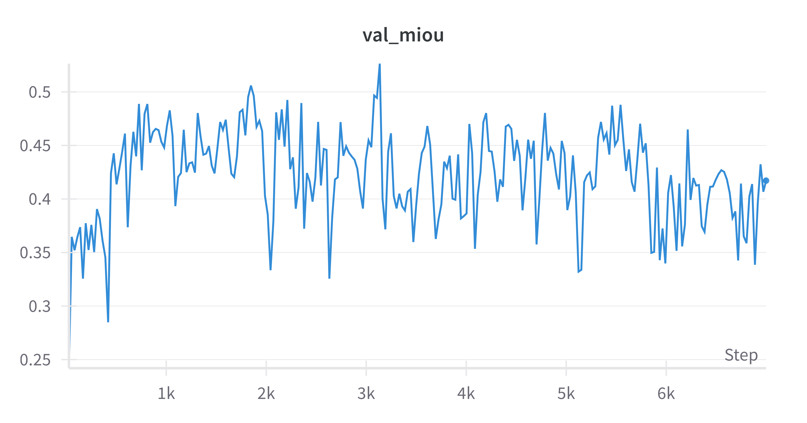
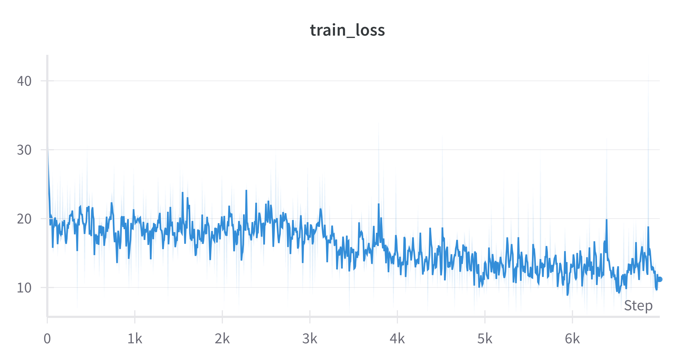

# Sereact 3D Object Detection

## 🧠 3D Object Detection with 3DETR and RGB-PointCloud Fusion

A PyTorch-based implementation of 3D object detection using **3DETR (3D Detection Transformer)** with RGB–PointCloud fusion. This project combines 3D point cloud data and 2D RGB images to improve 3D bounding box prediction and orientation estimation accuracy.

📄 For a detailed explanation and architecture overview, see the [`Submission Report`](SUBMISSION_REPORT.md).  
🚀 To get started with installation and setup, refer to the [`Get Started`](GET_STARTED.md) guide.


## 🚀 Features

- **3DETR Architecture**: Transformer-based 3D object detection
- **RGB-PointCloud Fusion**: Multi-modal input processing
- **3D Bounding Box Detection**: Accurate position and orientation estimation
- **Distributed Training**: Multi-GPU support with PyTorch distributed
- **CUDA Extensions**: Optimized PointNet++ operations
- **Comprehensive Loss Functions**: GIoU, angle, size, and corner losses

### 📈 Experimental Results

For a detailed analysis of the results, click here: [`Results Analysis`](RESULTS_ANALYSIS.md)

<h3 align="center">📊 Quantitative Distribution Analysis</h3>

<p align="center">
  
  
</p>

<p align="center">
  <em>Left:</em> Distributions of predicted vs. ground truth bounding box volumes, dimensions, ratios, and centers highlight model biases in shape, scale, and localization.  
  <br>
  <em>Right:</em> 3D point cloud visualization with predicted (red) and ground truth (green) bounding boxes showing spatial alignment and detection accuracy.
</p>

---

<h3 align="center">📈 Model Performance Over Time</h3>

<p align="center">
  
  
</p>

<p align="center">
  <em>Left:</em> Validation Mean IoU curve over training iterations.  
  <br>
  <em>Right:</em> Training loss curve during training over training iterations.
</p>


| Setting              |  IoU@0.25  |  Mean IoU  |
|----------------------|------------|------------|
| Without Augmentation |   0.7950   | **0.4432** |
| With Augmentation    |   0.8250   | **0.4653** |

## 📋 Requirements

### System Requirements
- **Python**: 3.7.16 (exact version required)
- **PyTorch**: 1.8.0 with CUDA support
- **CUDA**: 10.2 or 11.1 (compatible with PyTorch 1.8.0)
- **GPU**: NVIDIA GPU with 6GB+ VRAM
- **RAM**: 12GB+ system memory
- **Storage**: 8GB+ free space

### CUDA Toolkit
Ensure CUDA toolkit is installed and accessible:
```bash
nvcc --version  # Should show CUDA 10.2 or 11.1
```

#### Version Compatibility Matrix

| Component | Version | Notes |
|-----------|---------|-------|
| Python | 3.7.16 | Exact version required |
| PyTorch | 1.8.0 | With CUDA 11.1 support |
| TensorRT | 8.2.1.8 | Compatible with CUDA 11.1 |
| CUDA | 11.1+ | Runtime and toolkit |
| cuDNN | 8.x | Required by TensorRT |

## 📁 Dataset Structure

Organize your dataset as follows:
```
dataset/
├── object_1/
│   ├── bbox3d.npy          # 3D bounding box annotations
│   ├── mask.npy            # Segmentation mask
│   ├── pc.npy              # Point cloud data (N, 3 or N, 6)
│   └── rgb.png             # RGB image
├── object_2/
│   ├── bbox3d.npy
│   ├── mask.npy
│   ├── pc.npy
│   └── rgb.png
└── ...
```

## ⚙️ Configuration

Edit `config/base_train.yaml` to configure training:

```yaml
data:
  dataset: 'Sereact_dataset'
  data_path: '/path/to/your/dataset'
  batch_size: 1

model:
  encoder:
    type: 'vanilla'
    dim: 256
    nheads: 4
    num_layers: 3
  decoder:
    num_queries: 256
    num_layers: 6

train:
  max_epoch: 100
  base_lr: 0.0001
```

### 📂 Shared config for training/evaluation/deployment

| Argument           | Description                                          | Example Path                                                     |
| ------------------ | ---------------------------------------------------- | ---------------------------------------------------------------- |
| `--cfg`            | Path to YAML config file                             | `config/enhanced_loss_training.yaml` or `config/base_train.yaml` |
| `--data-path`      | Path to the input dataset                            | `/home-local2/akath.extra.nobkp/dl_challenge`                    |
| `--output`         | Directory to store logs, checkpoints, visualizations | `/home-local2/akath.extra.nobkp/sereact_enhanced` or `sereact`   |
| `--resume`         | Checkpoint path for evaluation or deployment         | `/.../ckpt_best.pth`                                             |
| `--tag`            | Experiment name                                      | `enhanced_loss_data_aug`                                         |
| `--nproc_per_node` | Number of GPUs used                                  | `1`, `2`, `3`, etc.                                              |


## 🏋️‍♂️ Training

To train the model, run the script below or use the pre-written launcher:

- ▶️ **Training Script:** [`train.sh`](./train.sh)

### 🔍 Evaluation Scripts
- ▶️ **With Visualization:** [`eval_visualisation.sh`](./eval_visualisation.sh)  
  Runs evaluation with **point cloud visualizations** and **box distribution plots**.

- ▶️ **Without Visualization:** [`eval.sh`](./eval.sh)  
  Standard evaluation script without rendering visual outputs.


## 🚀 Deployment

To export the trained model for deployment (e.g., ONNX or TensorRT), run the following script:

- ▶️ **Deployment Script:** [`deploy.sh`](./deploy.sh)

The exported models are available for deployment: the ONNX version can be found at ['model_onnx'](model.onnx), and the TensorRT-optimized version is available at ['model_tet'](model_trt.engine).


## 🏗️ Architecture

### Model Components
1. **Pre-Encoder**: Point cloud preprocessing and downsampling
2. **Encoder**: Transformer encoder with multi-head attention
3. **Decoder**: Transformer decoder for object queries
4. **Prediction Heads**: Box regression, classification, and angle prediction

### [Loss Functions](losses/LOSS_FUNCTIONS_GUIDE.md)
- **GIoU Loss**: Generalized IoU for 3D bounding boxes
- **Box Corner Loss**: L1 loss for corner accuracy
- **Size Loss**: L1 loss for size prediction
- **Angle Loss**: Classification + regression for orientation


### Training Time
- **Single GPU**: ~2 minute 24 seconds per epoch
- **Multi-GPU**: ~49 seconds per epoch

## 🔗 Dependencies

See `requirements.txt` for complete list of dependencies optimized for Python 3.7.16 and PyTorch 1.8.0.

## 📝 Notes

- This implementation is optimized for Python 3.7.16 and PyTorch 1.8.0
- CUDA extensions require compilation before first use
- Uses legacy `torch.distributed.launch` for distributed training
- Compatible with CUDA 10.2 and 11.1

## 🤝 Contributing

1. Ensure Python 3.7.16 and PyTorch 1.8.0 compatibility
2. Compile CUDA extensions after any changes
3. Test with both single and multi-GPU setups
4. Verify all imports work correctly
